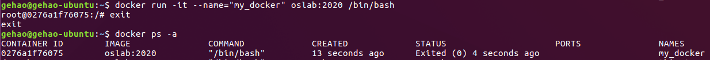
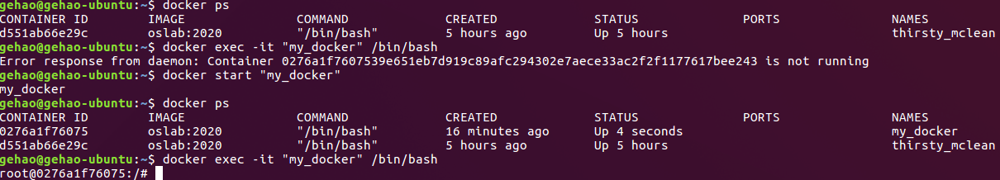

### Docker基本知识点

> 关于docker的基本命令和用法总结

#### Docker整体信息

- `docker info`：查看docker的系统信息，包括镜像、容器数以及docker的根目录
- `docker version`：查看docker版本

#### Docker镜像管理

- `docker save [options] IMAGE`：将指定镜像保存生成tar包

    ~~~bash
    # 将镜像my_image:v1生成my_image.tar包
    docker save -o my_image.tar my_image:v1
    ~~~

- `docker import file/url repository[:tag]`：从tar包或url中创建镜像，注意，命名规则为`仓库名:标签`，即每个镜像都属于某个仓库，且用标签唯一标识

    ~~~bash
    # 从my_image.tar包中创建docker镜像，并命名为my_image:v1，其中:v1是tag，表示第一版
    docker import my_image.tar my_image:v1
    ~~~

- `docker images [REPOSITORY]`：列出本地的镜像，如果指定某个仓库，则列出的是该仓库中不同tags所对应的所有镜像

    ~~~bash
    root@runoob:~# docker images  ubuntu
    REPOSITORY          TAG                 IMAGE ID            CREATED             SIZE
    ubuntu              16.04               90d5884b1ee0        9 weeks ago         188 MB
    ubuntu              18.04               4e3b13c8a266        3 months ago        136.3 MB
    ~~~

- `docker rmi [options] IMAGE`：删除本地的镜像

    `options`：

    - `-f`：强制删除
    - `--no-prune`：不删除该镜像的过程镜像，默认方式

    ~~~bash
    # 强制删除名为my_image:v1的本地镜像
    docker rmi -f my_image:v1
    ~~~

- `docker tag IMAGE REPOSITORY:TAG`：将IMAGE镜像做tag标记，使其归入某一仓库

- `docker history IMAGE`：列出指定镜像的创建历史

#### Docker容器管理

- `docker ps`：用于查看当前运行的容器
- `docker ps -a`：用于查看所有存在的容器(部分容器可能已经停止运行)

- `docker run [options] IMAGE [command]`：根据镜像`IMAGE`创建(并启动)一个新的容器，同时运行命令`command`(比如`/bin/bash`)，其中`options`提供了一些选项，常用的有：

    - `-it`：i表示交互模式，t表示为容器重新分配一个伪输入终端，it则表示以交互式终端模式运行容器

    - `--name="..."`：为容器指定名称

    - 举例： 

        ~~~bash
        # 其中oslab:2020为镜像名称
        # 使用镜像oslab:2020以交互模式启动一个叫做“my_docker”的容器，并在容器内执行/bin/bash命令
        docker run -it --name="my_docker" oslab:2020 /bin/bash
        ~~~

    - 注：创建的docker容器的`name`和`id`都可以从`docker ps -a`中列出的信息表中查看

    

- `docker create [options] IMAGE [command]`：创建一个新容器但不启动它，用法与`docker run`类似

- `docker rm [options] CONTAINER`：删除容器

    ~~~bash
    # 删除“my_docker”容器
    docker rm "my_docker"
    ~~~

- `docker start/stop/restart CONTAINER`：用于启动/停止/重启特定的容器

    注：可以用容器的name或id的前几位来表示CONTAINER

- `docker exec [options] CONTAINER command`：在**已经运行**的容器中执行`command`命令

    `options`：

    - `-it`：以交互式终端模式运行容器
    - `-u`：用户名，注意，该用户名必须已经在passwd file中注册过，否则会报错：unable to find user test: no matching entries in passwd file，如果不使用该参数，默认以`root`作为用户名

    注意，只有处于运行状态的docker才能被`exec`，并且需要输入两个参数，容器标识符(name or id)和运行命令(command)，如果exec对没有运行的docker使用，会报下图所示的error

    

    `exit`命令用于退出当前执行的容器

- `docker kill CONTAINER`：杀死一个运行中的容器
- `docker pause/unpause CONTAINER`：暂停/恢复容器中的所有进程

- `docker export [options] CONTAINER`：将当前的容器文件系统压缩成一个tar包导出

    注意容器export和镜像save的区别

    ~~~bash
    # 将id为d551ab66e29c的容器打包到tar文件中 (或直接用容器name:“my_docker”)
    docker export -o my_docker.tar d551ab66e29c
    ~~~

#### Docker本地磁盘映射

Docker Volume的基本原理：

- 数据卷(Data Volume)
    - Docker中的数据可以存储在类似于虚拟机磁盘的介质中，被称为数据卷(Data Volume)，数据卷既可以用来存储Docker应用的数据，也可以用于多Docker容器之间的数据共享，其呈现形式就是一个目录

- 文件系统
    - Docker镜像是由多个文件系统(只读层)叠加而成，当启动一个容器时，Docker会加载只读镜像层并在其上(镜像栈顶部)添加一个读写层。运行状态的Docker对文件的修改，实际上是先从只读层拷贝该文件的副本到读写层，再进行副本的修改，因此，容器的文件修改并不会影响到镜像。
    - 为了能够持久保存数据以及在容器间共享数据，就需要用到Docker volume的技术，它不再使用只读层和读写层的联合文件系统，而是直接以文件/目录的形式存在于宿主机上
- Docker容器启动的时候，可以用-v参数指定挂载宿主机的某个目录，基本形式为`-v 宿主机指定目录:容器内指定目录`，整条命令为`docker run -it -v 宿主机目录:容器目录 -u usr_name docker镜像id /bin/bash`