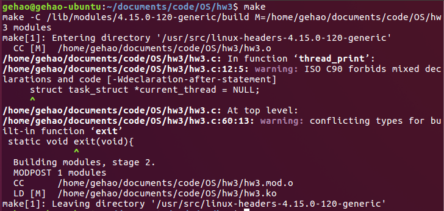
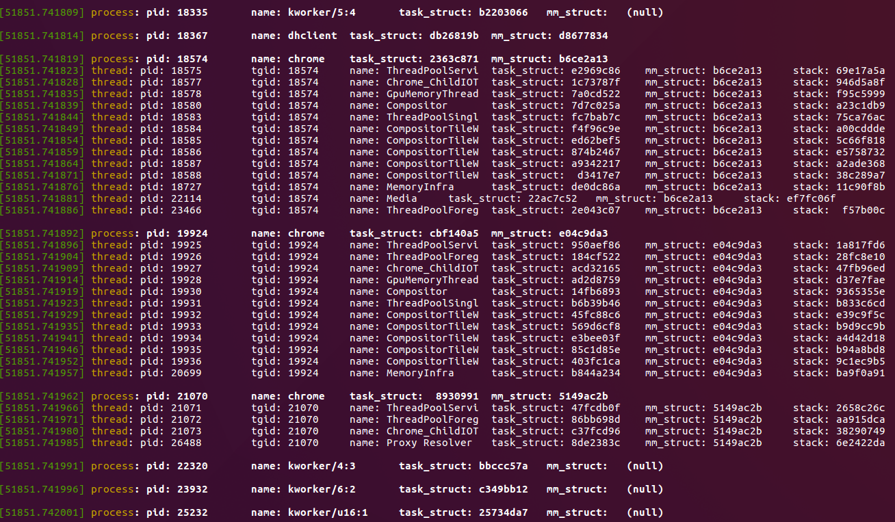

# 编写Linux内核模块

> 这里的linux内核模块功能以遍历输出内核进程及其所属的线程为例

#### 内核模块介绍

内核模块是Linux内核向外部提供的一个插口，其全称为动态可加载内核模块(Loadable Kernel Module, LKM)，简称为**模块**

Linux内核之所以提供模块机制，是因为它本身是一个单内核(monolithic kernel)，单内核的最大优点是效率高，因为所有的内容都集成在一起，但其缺点是可扩展性和可维护性相对较差，模块机制就是为了弥补这一缺陷

模块是具有独立功能的程序，它可以被单独编译，但不能独立运行，它在运行时被链接到内核作为内核的一部分在内核空间运行，这与运行在用户空间的进程是不同的；模块通常由一组函数和数据结构组成，用来实现一种文件系统、一个驱动程序或其他内核上层的功能

优点：

- 可以充分利用内核模块的动态装载性
- 将内核映象的尺寸保持在最小，并具有最大的灵活性
- 便于检验新的内核代码，而不需重新编译内核并重新引导

缺点：

- 对系统性能和内存利用有负面影响
- 装入的内核模块和其他内核部分一样，具有相同的访问权限，质量低的内核模块会导致系统崩溃
- 内核必须能够在卸载模块时通知模块，并且要释放分配给模块的内存和中断等资源
- 为了使内核模块访问所有内核资源，内核必须维护符号表，并在装入和卸载模块时修改这些符号表

#### 内核模块编程

##### 内核模块编程的基本特性

普通用户态应用程序和内核模块程序的区别总结如下：

|          | C语言应用程序 |   内核模块程序    |
| :------: | :-----------: | :---------------: |
| 使用函数 |    Libc库     |     内核函数      |
| 运行空间 |   用户空间    |     内核空间      |
| 运行权限 |   普通用户    |     超级用户      |
| 入口函数 |    main()     |   module_init()   |
| 出口函数 |    exit()     |   module_exit()   |
|   编译   |    Gcc –c     |     Makefile      |
|   连接   |      Gcc      |      insmod       |
|   运行   |   直接运行    |      insmod       |
|   调试   |      Gdb      | kdbug, kdb,kgdb等 |

可以看到，内核模块不能调用libc库中的函数，它运行在内核空间，且函数入口并不是`main()`，而是`module_init`，同理使用`module_exit`作为函数出口

此外，这里不使用libc中的`printf`，而是使用`printk()`作为输出函数，该函数不会直接在控制台输出，而是将内容输出到内核日志，为了查看内核日志信息，需要使用`dmesg`命令，而为了清除之前残留的内核日志信息，可以使用`dmesg -c`命令

在进行linux内核模块编写时，需要引入几个头文件：

- `linux/module.h`：加载内核模块到内核使用的核心头文件，所有模块都必须要使用该头文件
- `linux/kernel.h`：包含内核使用的类型、宏和函数
- `linux/init.h`：用于标记函数的宏，如 `__init`、`__exit`
- `linux/sched.h`：包含进程、线程相关信息

##### 遍历内核进程及其所属线程

###### list_head详解

在Linux内核中，提供了一个用来创建双向循环链表的结构list_head，其基本结构如下：

~~~c
struct list_head {
　　struct list_head *next, *prev;
};
~~~

可以看到，`list_head`只包含了双向链表所需的前后指针，并且**没有任何数据域**！实际上`list_head`不是拿来单独使用的，它一般被嵌到其它结构中，帮助其他结构形成双向链表的结构，该通用接口一定程度上实现了代码的重用

而`list_head`作为父结构中的一个成员，当得到`list_head`的实际地址(指针)时，可以利用该成员地址与父结构起始地址之间相对不变的offset，计算得到父结构的实际地址，进而实现父结构的双向链表结构

此外，还需要注意，在`list_head`中，**头结点head是不使用的**，这也是我实验中曾经遇到过的某个出错原因

###### task_struct详解

在linux中，PCB实际上是由`task_struct`来描述的，每一个进程都有一个进程描述符，具体就是`task_struct`结构体里存储的相关信息，在`linux/sched.h`文件里定义，而不同进程的`task_struct`是通过双向链表的方式连接起来的，其中有几个重要的成员变量：

~~~c
//state是进程的运行时状态，-1代表不可运行，0代表可运行，>0代表已停止。
volatile long state;
//mm_struct记录了进程内存使用的相关情况
struct mm_struct *mm;
//pid是进程号，注意这是内核自己维护的进程号，因为在Linux中线程是由进程实现的，用户看到的进程号是tgid域
pid_t pid;
//tgid是线程组号，和线程组内的领头进程的进程号一致，我们在用户程序中调用getpid()其实返回的是tgid值
pid_t tgid;
//thread_group是该进程所有线程的链表                                  
struct list_head thread_group;
~~~

###### linux中的进程和线程

在linux中，进程和线程都是用`task_struct`结构体来描述的，实际上线程的创建就是使用`clone`系统调用，并设置部分权限而成，`clone`与`fork`类似，创建的线程本质上就是含有原先进程部分权限的“进程”，因此进程和线程都可以直接用`task_struct`结构体来描述

**进程的遍历**：

进程的`task_struct`是一个双向链表，对链表逐一访问，就能够将进程遍历

注意，`init_task`是遍历的第一个进程

~~~c
static void process_print(struct task_struct *task){
    // for (p = &init_task ; (p = next_task(p)) != &init_task ; )
    for_each_process(task){
        // print the process info 
        printk("process: pid: %d\t name: %s\t task_struct: %8p\t mm_struct: %8p", task->pid, task->comm, task, task->mm);
        // print the thread info belong to this process
        thread_print(task);
    }    
}
~~~

**线程的遍历：**

在进程的`task_struct`中，有一个成员变量叫`thread_group`，这是用于串联起该进程所属线程的双向链表(即`list_head`)的头结点

在前面已经提及到，`list_head`的头结点是不使用的，因此由头结点指向的`thread_group.next`才是该进程所属的第一个线程的`list_head`(指针)，而从该指针开始，即可通过双向链表遍历该进程下的所有线程

在下面的实现代码中，先计算出`list_head`与`struct task_struct`之间的相对偏移量offset，并通过`list_head`的地址和相对偏移量计算出当前线程所在`task_struct`的地址，即`(struct task_struct*)((char*)current_list_head - offset);`

随后输出该线程的各种信息即可

~~~c
static void thread_print(struct task_struct *task){
    unsigned long offset;
    offset = offsetof(struct task_struct, thread_group);

    struct task_struct *current_thread = NULL;

    struct list_head *current_list_head = NULL;
    struct list_head *init_list_head = NULL;
    
    init_list_head = &(task->thread_group);

    current_list_head = init_list_head->next;
    while(current_list_head != init_list_head){
        current_thread = (struct task_struct*)((char*)current_list_head - offset);
        printk(KERN_INFO "thread: pid: %d\t tgid: %d\t name: %s\t task_struct: %8p\t mm_struct: %8p\t stack: %8p", \
               current_thread->pid, current_thread->tgid, current_thread->comm, current_thread, current_thread->mm, \
               current_thread->stack);
        current_list_head = current_list_head->next;
    }
    printk("\n");
}
~~~

#### Makefile编写

本次实验的makefile如下所示，其中

- `obj-m`定义了可加载模块目标

- `/lib/modules/$(shell uname -r)/build`是编译内核模块对应的Makefile所在路径

    - `$(shell uname -r)`命令返回当前内核构建版本

        ~~~bash
        ~$ uname -r
        4.15.0-120-generic
        ~~~

- `M=$(PWD)`变量赋值告诉make命令实际工程文件存放位置，在试图建立模块(modules)目标前，回到模块源码目录，而此目标会在 `obj-m` 变量里面找模块列表

- 执行`make`后默认调用`ALL`下的命令，此时会生成`hw3.ko`，即编译而成的内核模块

- 通过`insmod`命令可以将模块插入内核，通过`rmmod`命令可以删除该模块

- 通过`dmesg`命令可以查看该模块输出的内核日志信息，加上`-c`参数则是清空内核日志信息

~~~makefile
obj-m = hw3.o
KDIR = /lib/modules/$(shell uname -r)/build
PWD = $(shell pwd)
MAKE = make

ALL:
	$(MAKE) -C $(KDIR) M=$(PWD) modules

install:
	sudo insmod hw3.ko
	
clean:
	$(MAKE) -C $(KDIR) M=$(PWD) clean
	sudo rmmod hw3.ko
	sudo dmesg -c

run:
	dmesg
~~~

#### 实验结果

##### 实验执行结果及分析如下

- 执行`make`进行module编译

- 执行`make install`进行`hw3.ko`内核模块的加载

    

- 执行`make run`(即dmesg)输出该模块的输出信息

    由于输出信息过长，这里只展示部分截图

    在下图中，白色加粗的行输出的是进程(process)信息，白色不加粗的行输出的是该进程所属的线程(thread)信息，可以看到：

    - 部分进程没有所属线程，属于单进程运行
    - 以`pid`为18574，`name`为chrome的进程为例，其所属的所有线程的`tgid`成员值都等于进程的`pid`，为18574，而线程的`pid`值各不相同
    - 由此可见，对线程来说，`tgid`标识的是其所属进程的进程id号，而`pid`标识的则是自身的线程号；对进程来说，`pid`标识的就是本身的进程id号

    

##### 思考题

- Q: 加载模块,输出显示进程及线程信息,截图证明实验结果,上传模块文件代码.

    A: 在[上一部分](#result)已说明

- Q: 如何判断区分进程和线程,根据什么来判断?

    A: 在linux中无论是进程还是线程，只要是调度单元，都通过 `task_struct`表示，其中保存有关线程/进程中的一切信息，主要包括有线程/进程状态、与其他线程/进程关系、虚拟内存相关、日志相关、线程/进程限制等，该结构体定义在include/linux/sched.h文件中

    然而在`struct task_struct`中并没有明确的标识来区分该task是线程还是进程，不过可以通过pid和tgid简单判断当前task是哪种类型

    **pid**用于标识不同进程和线程，而**tgid**值等于进程第一个线程(主线程)的pid值,，从前面的实验结果中可以看出，属于同一个进程的线程，其`tgid`都相等，且等于进程的`pid`

- Q: 我们为什么要使用内核模块,内核模块有何优缺点?

    A: 在[内核模块介绍](#module)中已说明

- Q：线程和子进程有何区别?

    A：从创建方式看，线程是通过`clone`系统调用创建而成的，而子进程是通过`fork`系统调用创建而成的，在clone的过程中会赋予即将创建的线程一定权限，用flag标志位来表示，如果所有权限都不给，那么此时clone就是fork，得到的线程就是子进程，即对父进程的一份完整拷贝

    从中也可以看出，子进程实际上就是对原父进程没有访问权限的拷贝，而线程则是拥有对父进程资源的一定访问权限，可以有相同的虚拟地址空间、共享全局变量等

    从定义上来看，进程是资源分配的最小单位，线程是程序执行的最小单位；进程有自己的独立地址空间，每启动一个进程，系统就会为它分配地址空间，建立数据表来维护代码段、堆栈段和数据段，这种操作非常昂贵；而线程是共享进程中的数据的，使用相同的地址空间，因此CPU切换一个线程的花费远比进程要小很多，同时创建一个线程的开销也比进程要小很多；此外进程间通信需要通过IPC方式，而线程间通信可以直接通过全局变量实现

- Q：说明list_head结构的作用.

    A：在[list_head详解](#list_head)中已说明

#### reference

[Copy On Write机制](https://juejin.im/post/6844903702373859335)

[Linux 内核list_head 学习（一）](https://www.cnblogs.com/zhuyp1015/archive/2012/06/02/2532240.html)

[linux进程描述符task_struct详解](https://blog.csdn.net/hongchangfirst/article/details/7075026)

[从内核角度看Linux 线程和进程的区别](https://blog.csdn.net/qq_28351465/article/details/88950311)

[一道面试题：说说进程和线程的区别](http://mp.weixin.qq.com/s/f_OezOorxInJqzx8WT7x2g)

